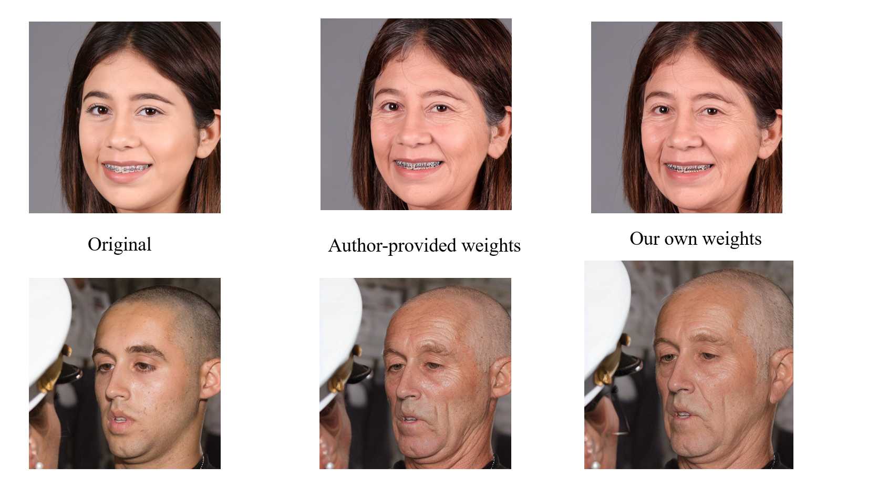
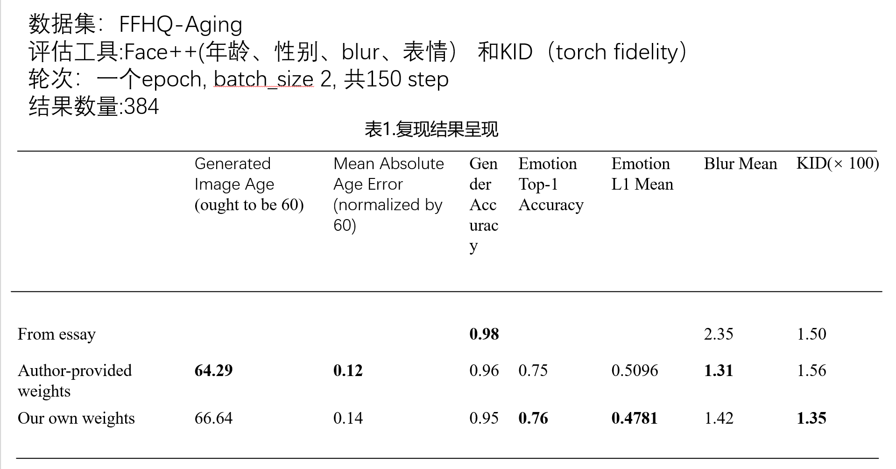

## the reproduction for the essay
>essay name:Chen, X., & Lathuilière, S. (2023). Face Aging via Diffusion-based Editing.
>source code:https://github.com/MunchkinChen/FADING/
### 修改specialize.py
增加了源代码缺失的梯度更新、反向传播：
```python
instance_loss = loss
                accelerator.backward(loss)
                instance_loss = loss
                optimizer.step()                   # 尝试更新参数（accelerator 会自动限流）
                lr_scheduler.step()                # 更新学习率
                optimizer.zero_grad()  
```
### 进行复现
采用的是https://huggingface.co/stable-diffusion-v1-5/stable-diffusion-v1-5 的stable-diffusion-1.5作为pretrain model进行训练，在FFHQ-Aging-Dataset 上进行了150步预训练，随后进行推理，生成图片，得到以下实例和最终结果:


